# PQ-SIFT: Projected-Query Sign-based Filtering of Tokens

<p align="center">
  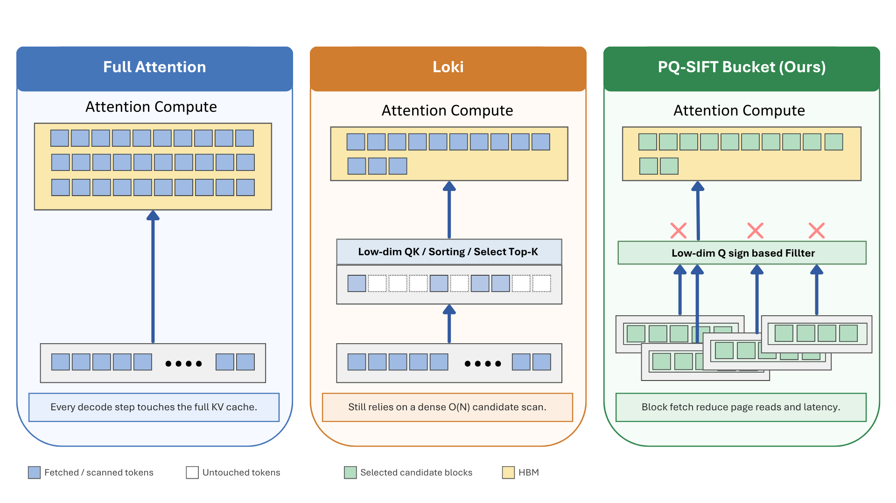
</p>

**PQ-SIFT** is a query-aware sparse KV-cache retrieval method for efficient long-context LLM decoding.  
Instead of running dense low-rank Top-K scoring over every past token, PQ-SIFT projects queries/keys into a PCA space, filters candidate KV blocks using compact **sign/range metadata**, and then runs exact attention only on the surviving candidates.

> **TL;DR**: PQ-SIFT-Bucket trades dense ranking for page-friendly block admission. It keeps more useful attention mass than a comparable Loki-style sparse baseline while reducing measured decode latency in long-context settings.

---

## Why PQ-SIFT?

| Method | Candidate selection | KV access pattern | Main trade-off |
|---|---|---|---|
| Full attention | Attend all tokens | Full-cache read | Accurate but expensive |
| Recent window | Fixed local tokens | Small read | Fast but loses distant evidence |
| Loki-style sparse | Dense PCA scoring + Top-K | Scattered token gather | Reduces final attention, but candidate generation is costly |
| **PQ-SIFT-Bucket** | **PCA sign/range block filter** | **Contiguous 64-token block fetch** | **High retained mass + lower latency** |

---

## Method

1. **Offline PCA metadata**: project cached keys into a low-dimensional PCA subspace.
2. **Compact block summaries**: store sign/range metadata per 64-token KV block.
3. **Online query filtering**: project the query once, reject implausible blocks using metadata.
4. **Exact attention on candidates**: fetch selected blocks and compute exact QK-softmax-V only there.

```text
Full attention:      read all KV  ───────────────► exact attention
Loki-style sparse:   dense low-rank scan + Top-K ► scattered exact attention
PQ-SIFT-Bucket:      sign/range metadata filter  ► block fetch ► exact attention
```

---

### Quality sanity check

<p align="center">
  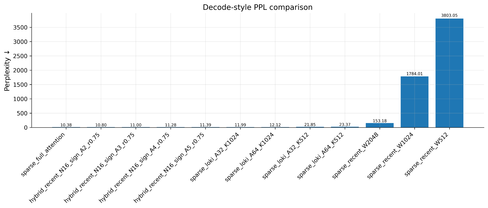
</p>

Moderate sign/range settings stay close to full attention in decode-style perplexity, while aggressive recent-window baselines degrade sharply.

### Latency breakdown

<table>
<tr>
<td width="50%">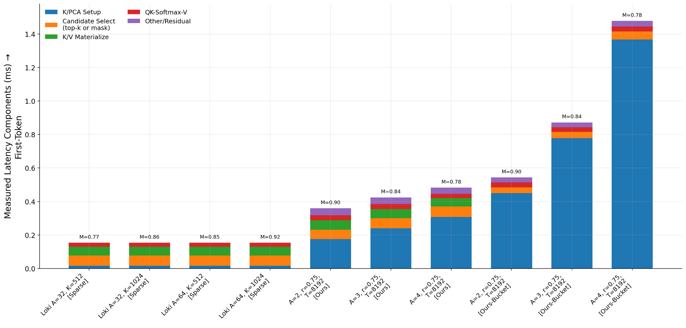</td>
<td width="50%">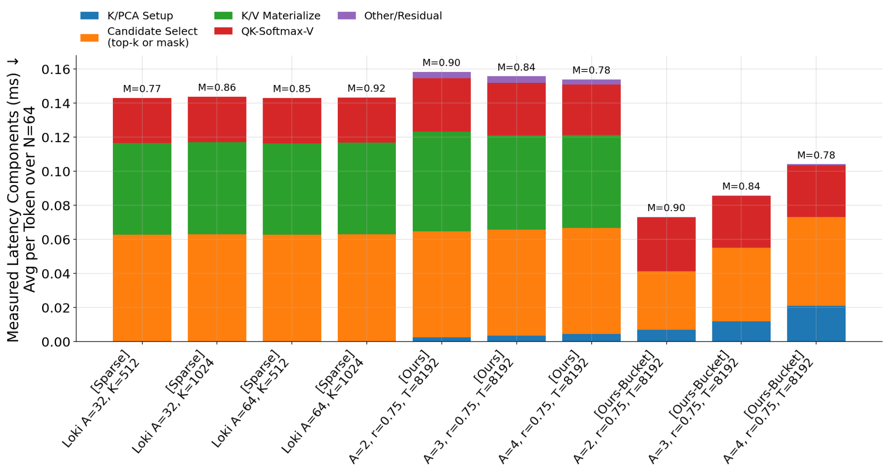</td>
</tr>
<tr>
<td align="center">First-token cost</td>
<td align="center">Amortized decode cost over N=64</td>
</tr>
</table>

Bucketed retrieval is most useful when setup and metadata costs are amortized across generated tokens.

---

## Tuning: `A` and `r`

`A` controls the number of PCA axes. `r` controls how much opposite-sign/range-expanded candidate mass is admitted.

<table>
<tr>
<td width="50%">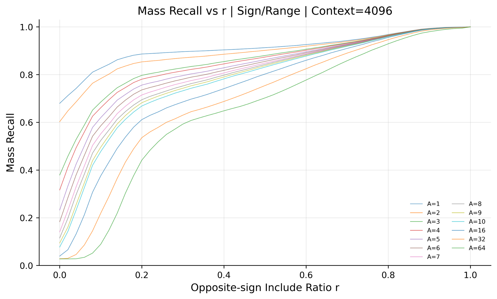</td>
<td width="50%">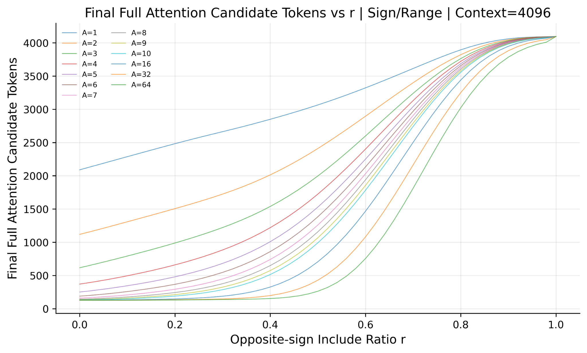</td>
</tr>
<tr>
<td align="center">Higher `r` recovers more attention mass</td>
<td align="center">Higher `r` also admits more candidates</td>
</tr>
</table>

<table>
<tr>
<td width="50%">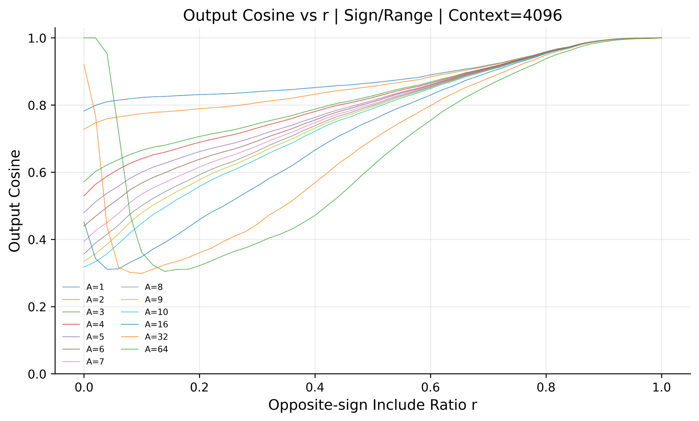</td>
<td width="50%">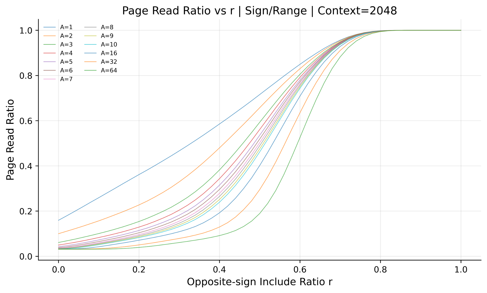</td>
</tr>
<tr>
<td align="center">Output fidelity</td>
<td align="center">Page-read cost</td>
</tr>
</table>

Recommended starting point: **PQ-SIFT-Bucket, `A=2~4`, `r≈0.75`**.

---

## Layer Sensitivity

<p align="center">
  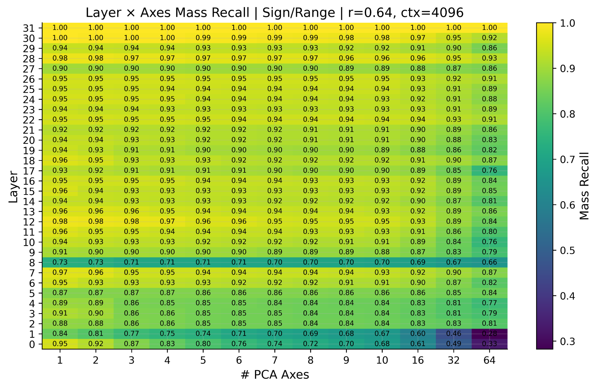
</p>

Sparse filtering is not uniformly safe across layers. Early layers and some specific layers are more sensitive, so a production policy should allow layer-wise fallback or conservative thresholds.

---

## Component Analysis

<table>
<tr>
<td width="50%">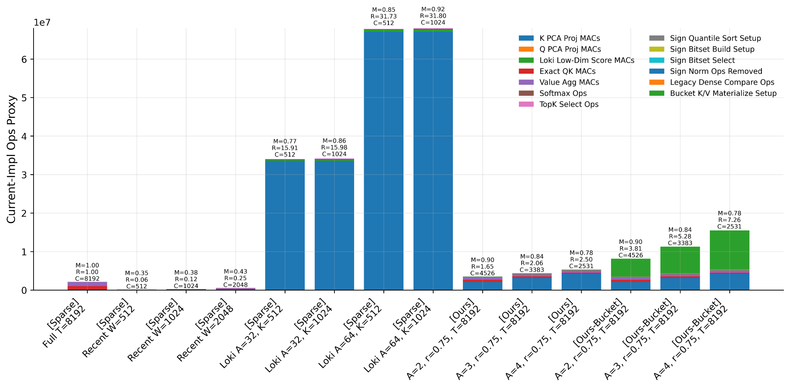</td>
<td width="50%">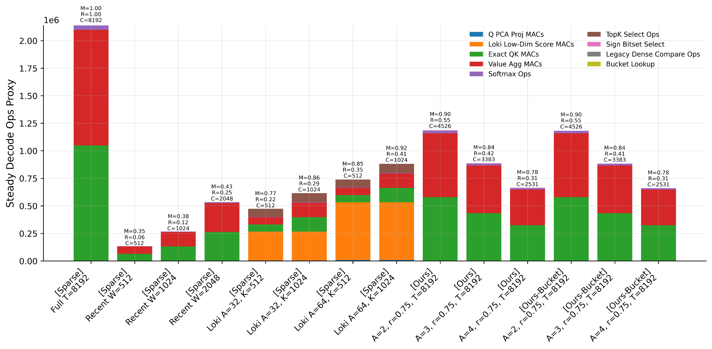</td>
</tr>
<tr>
<td align="center">Current implementation cost</td>
<td align="center">Realistic steady decode cost</td>
</tr>
</table>

<table>
<tr>
<td width="50%">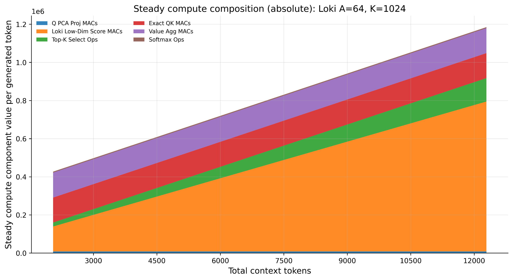</td>
<td width="50%">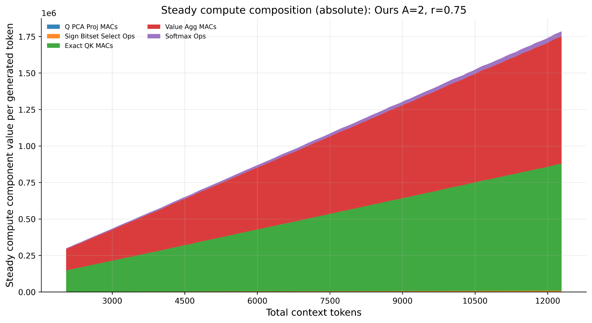</td>
</tr>
<tr>
<td align="center">Loki: dense low-rank scoring dominates</td>
<td align="center">PQ-SIFT: block filtering + exact attention</td>
</tr>
</table>

---

## Experimental Setup

- **Backbone**: LLaMA-3.1-8B
- **PCA basis**: WikiText-103 train, approximately 20M tokens
- **Evaluation**: WikiText-2 test, decode-style sparse attention probes
- **Context lengths**: 2K to 96K tokens
- **Main metrics**: Mass Recall, Output Cosine, Page Read Ratio, MAC Ratio, Decode Latency, PPL sanity check
- **Baselines**: Full Attention, Recent Window, Loki-style low-rank sparse attention

---

## Takeaway

PQ-SIFT suggests that sparse long-context attention should be evaluated as an **end-to-end decode pipeline**, not only as final attention FLOPs. A practical sparse method must preserve attention mass, keep candidate selection cheap, and align KV reads with memory-friendly blocks.

---

## Team

- **Minseok Choi** — problem formulation, PQ-SIFT design, experiments, baseline analysis
- **Geonhee Jang** — experiment organization, figure generation, systems analysis, report writing

---

## Citation

```bibtex
@misc{pqsift2026,
  title  = {PQ-SIFT: Projected-Query Sign-based Filtering of Tokens for Efficient Long-Context Attention},
  author = {Choi, Minseok and Jang, Geonhee},
  year   = {2026},
  note   = {Korea University COSE461 Final Project}
}
```
